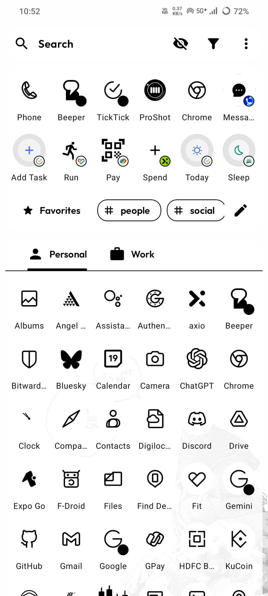
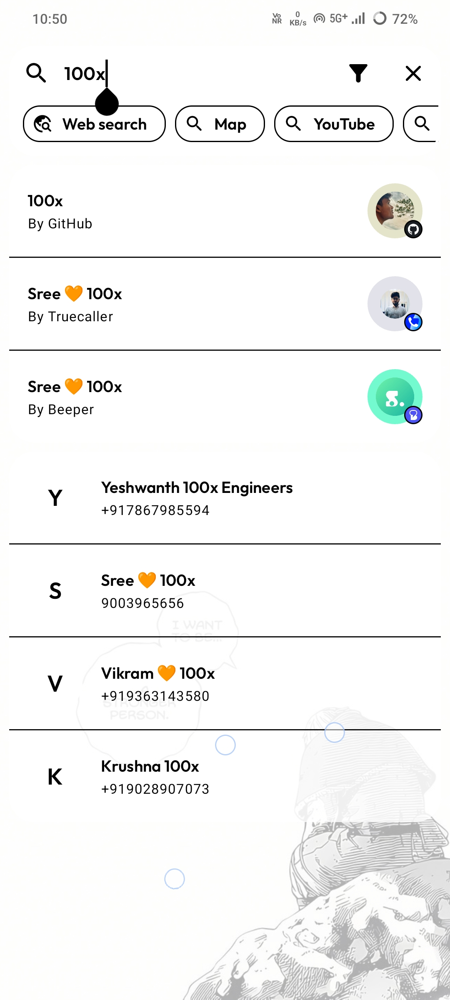
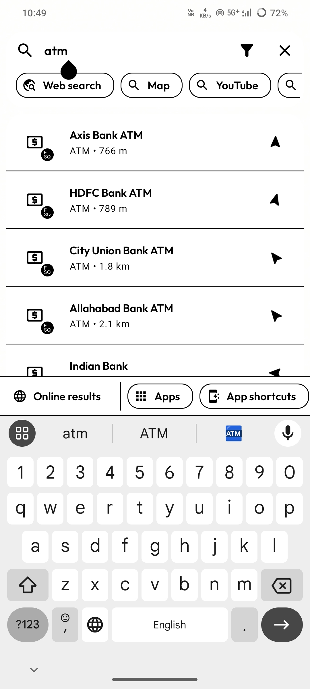
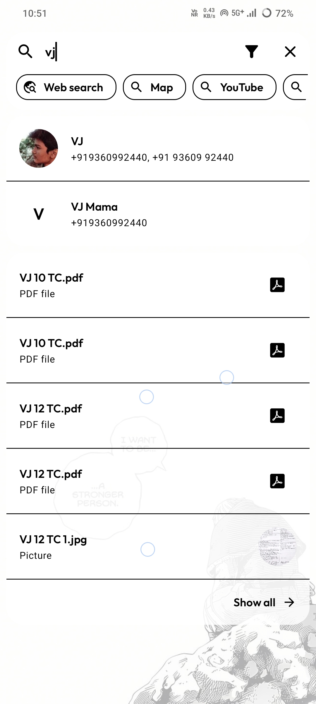
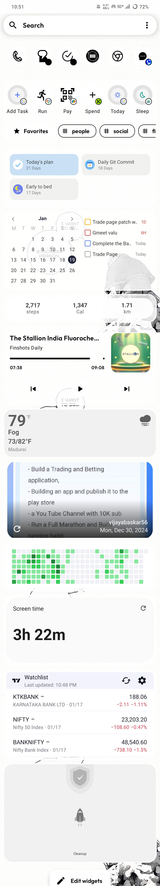

# Kvaesitso Launcher: The Game-Changing Android Launcher That Redefined My Mobile Experience

As someone who loves exploring and testing various apps, I’ve always sought the perfect balance between functionality and simplicity. Before settling on any app, I make it a point to try multiple options, analyzing each one’s pros and cons. This method has helped me find gems that truly enhance my daily experience.

When it comes to Android launchers, I’ve tried almost everything—[Nova Launcher](https://play.google.com/store/apps/details?id=com.teslacoilsw.launcher), [Niagara Launcher](https://play.google.com/store/apps/details?id=bitpit.launcher), Microsoft Launcher, Neo Launcher, and more. Yet, none of them fully satisfied my needs. Then I stumbled upon [Kvaesitso Launcher](https://kvaesitso.mm20.de/). It didn’t just meet my expectations; it redefined how I interact with my phone.

Kvaesitso’s unique features, minimalist design, and productivity-first approach have transformed my daily workflow. This post dives into what makes Kvaesitso so special and why it deserves a place on your device.

## What is Kvaesitso?

Kvaesitso is a **search-focused, free, and open-source launcher for Android**. It’s more than just a launcher—it’s a productivity tool that combines clean design with powerful features to streamline how you use your phone. What sets Kvaesitso apart is its emphasis on search, customization, and user-focused functionality.

## Why Kvaesitso Stands Out

### 1. **Search at the Core**

The heart of Kvaesitso is its search functionality, which empowers you to interact with your device more efficiently. It eliminates distractions and helps you focus on tasks. Here’s why it’s a game-changer:

- **Universal Search:** You can search for apps, files, contacts, tasks, and even cloud storage items (like Google Drive or NextCloud) from a single search bar. It’s seamless and fast.
- **Online Results:** Search terms can fetch results directly from online platforms, saving you time and effort.
- **Focused Workflow:** Avoid distractions like endless feeds. For instance, searching "how to make a sandwich" directly brings up YouTube’s search results instead of its homepage.
- **Quick Actions:** Directly perform tasks like calling a contact, opening maps for directions, or running calculations—all without leaving the search interface.
- **Filters:** Narrow down search results for more precise actions, such as filtering by apps, contacts, or files.

### 2. **Comprehensive Widget System**

Kvaesitso offers a thoughtfully designed widget system that centralizes and customizes your favorite widgets. You can access them with gestures, keeping your home screen clean while ensuring everything you need is just a swipe away. Key widgets include:

- **Calendar Widget:** Keep track of events and appointments with ease.  
- **Clock Widget:** A clean, minimalist time display.  
- **Favorites Widget:** Access frequently used apps or contacts quickly.  
- **Music Widget:** Control your media playback without launching separate apps.  
- **Notes Widget:** Jot down ideas or reminders effortlessly.  
- **Weather Widget:** Stay updated with local weather in a beautifully designed interface.

### 3. **Customization That Puts You in Control**

Kvaesitso’s customization options are exceptional, offering both aesthetic and functional flexibility:

- **Favorites and Tags:** Organize your apps with tags and mark your most-used ones as favorites for quick access.  
- **Color Schemes:** Personalize the look and feel of the launcher with a variety of color themes.  
- **Themed Icons:** Match your launcher’s icons with your preferred aesthetic.  
- **Per-Item Customization:** Customize individual items for an even more personalized experience.

### 4. **Plugin System for Expanded Functionality**

The plugin system is one of Kvaesitso’s standout features. It allows you to extend the launcher’s capabilities with add-ons like:

- **Google Search Plugin:** Enhance your search experience with direct Google results.  
- **Map Search Plugin:** Quickly find locations and navigate with ease.  
- **Calculator and Unit Converter:** Perform quick calculations or conversions directly from the launcher.

This system encourages a community-driven approach, where developers can create new plugins to enhance the launcher further.

## Why Kvaesitso Deserves More Recognition

Despite its incredible features, Kvaesitso remains relatively unknown. It’s a launcher that prioritizes productivity, customization, and simplicity without sacrificing functionality. The fact that it’s both free and open source makes it even more appealing

For those who want a launcher that does more than just look good, Kvaesitso is a must-try. Its search-focused design and robust feature set offer a unique experience that’s hard to find elsewhere.

## And Here is a Glimps of  Setup

## Final Thoughts

Kvaesitso Launcher has completely transformed how I use my Android device. Its search-first approach, extensive widget support, and customization options make it a standout in a sea of launchers. If you’re tired of distractions and want a launcher that helps you stay focused and productive, Kvaesitso is the answer.

What’s your go-to launcher? Have you tried Kvaesitso? Let me know your thoughts in the comments below!
