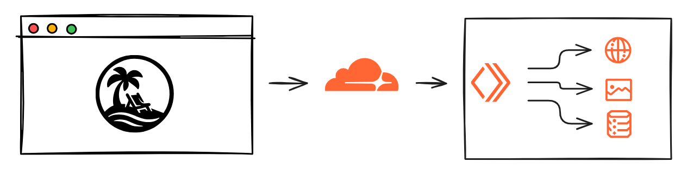
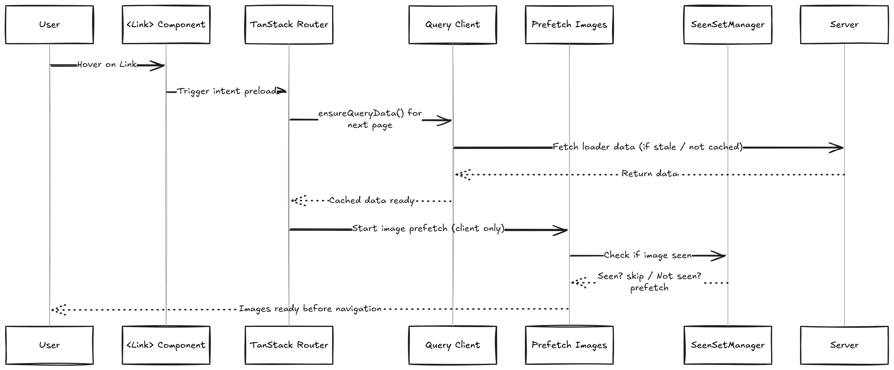
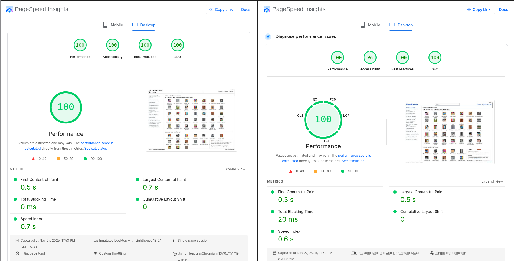
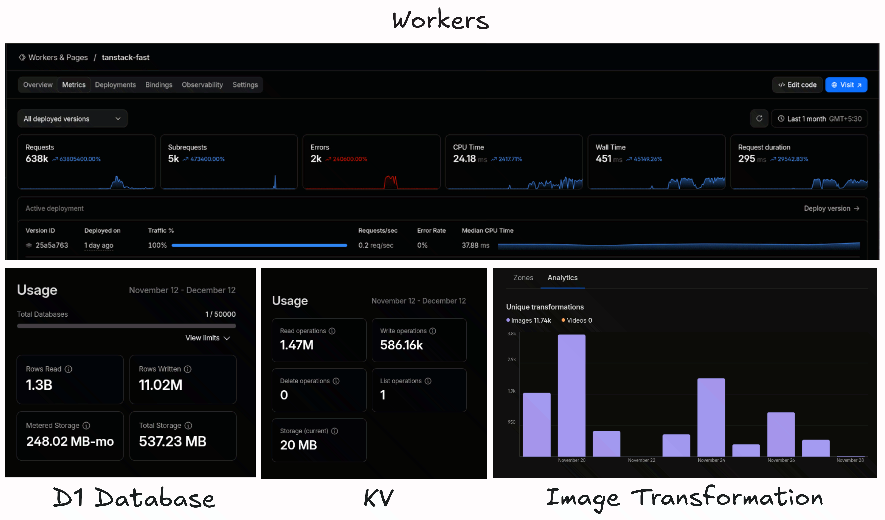

Sharing my Learning on Building TanstackFaster, inspired by NextFaster, powered by Cloudflare's global edge network, creates a user experience that feels instantaneous while remaining cost-effective at scale.

# TanstackFaster

A highly performant e-commerce template using TanStack and Cloudflare, inspired by NextFaster by @ethanniser, @RhysSullivan and @armans-code. This version showcases the power of TanStack Router, Query, and Start deployed on Cloudflare's edge platform.

This Project aims to demonstrate how TanStack + Cloudflare can deliver extremely fast, scalable and cost-efficient e-commerce experiences and that’s why I loved building this project.

## Architecture Overview


## The Stack

- **TanStack Start**: Full-stack React with streaming SSR
- **TanStack Router**: Type-safe routing with intelligent preloading
- **TanStack Query**: Advanced data fetching and caching
- **Cloudflare Workers**: Serverless compute
- **Cloudflare D1**: SQLite-compatible serverless SQL
- **Cloudflare R2**: S3-compatible storage with no egress fees
- **Cloudflare KV**: Global, eventually-consistent key-value store for edge caching

Fast performance is achieved mainly through 3 layers of optimization.

1. Image Optimization
2. Preloading
3. Caching
---

## Image Optimization

| PS: I really wish Tanstack Start has a Image component similar to NextJS, CloudFlare Image Transformation is not Great thing and it still takes average of 300ms.

Images are typically the heaviest assets when dealing with 1M products. I implemented a multi-faceted image optimization strategy that addresses loading performance, bandwidth efficiency, and user experience. I used a combination of techniques involving pre-fetching images on hover similar to NextFaster, but only a limited number of them to avoid network waterfalls, by dynamically adjusting prefetching behavior based on device capabilities and LRU cache for duplicate prevention.
```tsx
export const getEagerImageCount = createClientOnlyFn((): number => {
  return window.innerWidth < 768 ? 5 : 15;
});

export class SeenSetManager {
// prevents the same image from being prefetched multiple times across different page transitions
  private seen = new Set<string>();
  private maxSize = 1000;
  private insertionOrder: string[] = [];

  isSeen(src: string): boolean {
    return this.seen.has(src);
  }

  markSeen(src: string): void {
    if (!this.seen.has(src)) {
      this.seen.add(src);
      this.insertionOrder.push(src);

      // LRU eviction when size exceeds limit
      if (this.seen.size > this.maxSize) {
        const oldest = this.insertionOrder.shift();
        if (oldest) {
          this.seen.delete(oldest);
        }
      }
    }
  }
}

// src/lib/prefetch-images.ts
const images: PrefetchImage[] = collections.flatMap((collection) =>
  collection.categories
    .filter((cat) => cat.imageUrl)
    .map((cat) => ({
      src: getOptimizedUrl(cat.imageUrl ?? "/placeholder.webp", 48, 48, 65), // based on the page image height and width.
      alt: cat.name,
      loading: count++ < eagerCount ? "eager" : "lazy",
      width: 48,
      quality: 65,
    }))
);

```
Unpic helps us transform and serve images based on the height, width and quality of the image that we are passing, which uses Cloudflare Image Transformation Feature with URL Transformation.

**Quality strategy**:

- **Thumbnails (48px)**: 65% quality - sufficient for small previews
- **Product images (256px)**: 60% quality - balance between quality and load time
- **Hero images**: Higher quality with progressive loading

### Cloudflare Image Resizing Integration

Automatic optimization through Cloudflare's edge network:

```tsx
// pre-loading images
import { transformUrl } from "unpic";

export function getOptimizedUrl(
  src: string,
  width: number,
  height: number,
  quality: number,
) {
  return (
    transformUrl(
      {
        url: src,
        width,
        height,
        quality,
        provider: "cloudflare",
      },
      {
        cloudflare: {
          f: "auto",
          format: "auto",
        },
      },
      {
        cloudflare: {
          domain: "tanstack-faster.tancn.dev",
        },
      },
    ) || src
  );
}
```

```tsx
// Image Component that will follow the same url transformation 
// for prefetching and caching.
import { Image as UnImage } from "@unpic/react";
import type { ImgHTMLAttributes } from "react";

interface ImageProps
	extends Omit<ImgHTMLAttributes<HTMLImageElement>, "srcSet"> {
	src: string;
	alt: string;
	width: number;
	height: number;
	quality?: number;
	blurDataURL?: string;
}

export function Image({
	src,
	alt,
	width,
	height,
	quality = 60,
	loading = "eager",
	decoding = "async",
	className,
	blurDataURL,
	...props
}: ImageProps) {
	return (
		<UnImage
			src={src}
			alt={alt}
			width={width}
			height={height}
			loading={loading}
			decoding={decoding}
			className={className}
			style={
				blurDataURL
					? {
							backgroundImage: `url(${blurDataURL})`,
							backgroundSize: "cover",
							...props.style,
						}
					: props.style
			}
			cdn="cloudflare"
			options={{
				cloudflare: {
					domain: "images.tancn.dev",
				},
			}}
			operations={{
				cloudflare: {
					width: width,
					height: height,
					quality: quality,
					f: "auto",
					format: "auto",
				},
			}}
			{...props}
		/>
	);
}

```

**Benefits**:

- **Format auto-detection**: Serves WebP/AVIF to supported browsers
- **Edge processing**: Images are optimized at Cloudflare edge locations
- **Bandwidth reduction**: 50-60% size reduction vs original images
---
## Preloading

Tanstack Router has amazing [preloading](https://tanstack.com/router/latest/docs/framework/react/guide/preloading) functionality backed into it, and it has three different strategies for preloading:

- **intent** → preload on hover using hover and touchstart events
- **viewport** → preload when the component reaches the viewport
- **render** → preload as soon as <Link> mounts

I am extensively using intent preloading throughout my application, as one page could have 50 to 70 Links and I don’t want to cause waterfalls or hammer the APIs

So when a user hovers over the image link, the loader will start fetching the next page API as well as pre-loading images, so when the next page loads, the images and content will already be there. This differs from how NextFaster handles preloading, but it's the method I find suitable with TanStack, as Router Loaders are **isomorphic** and preloading image functions are only run on the client, not on the server, to avoid pre-fetching images on the server.

```tsx
<Link
	key={category.name}
	className="flex w-[125px] flex-col items-center text-center"
	to="/products/$category"
	preload="intent"
	params={{
		category: category.slug,
	}}
>
<Image // same as pre-loading  images
	loading={imageCount++ < 30 ? "eager" : "lazy"}
	decoding="sync"
	src={category.imageUrl ?? "/placeholder.webp"}
	alt={`${category.name}`}
	className="mb-2 h-14 w-14 border hover:bg-accent2"
	width={48}
	height={48}
	quality={65}
/>
<span className="text-xs">{category.name}</span>
</Link>

export const Route = createFileRoute("/_layout/")({
	loader: async ({ context }) => {
		const [collections, productCount] = await Promise.all([
			context.queryClient.ensureQueryData(getCollectionsOptions()),
			context.queryClient.ensureQueryData(getProductCountOptions()),
		]);
// fire and forget about image pre-loading
// to prevent blocking the render, additionally
		prefetchCollectionsImages(
			collections as (Collection & { categories: Category[] })[],
			context.seenManager,
		);

		return { collections, productCount };
	},
	head: ({ loaderData }) => {
		// SEO Stuffs
	},
	component: RouteComponent,
});

// I wanted to prefetch images only on the client side.
export const prefetchCollectionsImages = createIsomorphicFn().client(
	async (collectionDetails: any, seenManager: SeenSetManager) => {
		const eagerCount = getEagerImageCount();
		let count = 0;
		const images: PrefetchImage[] =
			collectionDetails?.[0]?.categories
				?.filter((cat: any) => cat.imageUrl)
				.map((cat: any) => ({
					src: getOptimizedUrl(cat.imageUrl ?? "/placeholder.webp", 48, 48, 65),
					alt: cat.name,
					loading: count++ < eagerCount ? "eager" : "lazy",
					width: 48,
					quality: 65,
				})) ?? [];

		prefetchImages(images, seenManager);
	},
);
```



#### Advanced Settings for Preloading

The cool thing about TanStack Router is that it also has caching built-in, and we can tweak it at router level or root level. Here's how I'm configuring it at root level. Also note that the project is mostly an e-commerce site with static products, so it's fine to have a high staleTime. 

```tsx
// src/router.tsx
const router = createRouter({
  routeTree,
  defaultPreload: "intent", // Preload on hover
  defaultPreloadDelay: 0,    // No delay for instant response default is 50
  defaultGcTime : 1000 * 60 * 10, // 10 minutes
  defaultStaleTime : 1000 * 60 * 5, // 5 minutes
	defaultPreloadIntentProximity: 100,
  scrollRestorationBehavior: "smooth",
});
```

## Caching

Caching is the cornerstone of performance. So, I implemented a sophisticated multi-layer approach that serves data from the fastest possible location.

Level 0 → Cloudflare Caching

- Using Cloudflare [Cache Rule](https://developers.cloudflare.com/cache/how-to/cache-rules/) to  Set the Domain Level Rules on Caching

Level 1 → Edge Caching with Cloudflare KV

Frequently accessed data is cached for fast retrieval. Here's how the multi-layer caching strategy works:

```tsx
const CACHE_STRATEGIES = {
  collections: 86400,      // 24 hours - rarely change
  categories: 43200,       // 12 hours - moderate change frequency
  products: 3600,          // 1 hour - inventory changes
  search: 7200,            // 2 hours - search results
  user_sessions: 1800,     // 30 minutes - security
};

// server functions
export const getCollections = createServerFn()
  .validator(z.object({}))
  .handler(async ({ ctx }) => {
    const cacheKey = "collections";
    const cacheHit = await ctx.context?.env.CACHE.get(cacheKey, "json");

    if (cacheHit && cacheHit !== null && cacheHit !== undefined) {
      return cacheHit;
    }

    const collections = await db.query.collectionsTable.findMany({
      with: {
        categories: {
          where: eq(categoriesTable.imageUrl, isNotNull(categoriesTable.imageUrl)),
          orderBy: asc(categoriesTable.name),
        },
      },
    });

    // Asynchronous cache update
    ctx.context?.env.WAIT_UNTIL(
      ctx.context.env.CACHE.put(cacheKey, JSON.stringify(collections), {
        expirationTtl: CACHE_STRATEGIES.collections,
      })
    );

    return collections;
  });
```

**Level 2** → Browser Level Caching With Tanstack Query

- Each server function is called with Query, so it would get all the benefits of Tanstack Query.
- Also each route was cached so that navigation to the already visited page feels instant, thanks to Tanstack Router Caching.

```tsx
// src/api/query-options.ts
export const getCollectionsOptions = () =>
  queryOptions({
    queryKey: ["collections"],
    queryFn: ({ signal }) => getCollections({ signal }),
    staleTime: 1000 * 60 * 10, // 10 minutes
    gcTime: 1000 * 60 * 30,     // 30 minutes garbage collection
  });

```

## The Cloudflare Stack

I chose Cloudflare instead of Vercel as NextFaster demonstrates the Vercel capability very well. I wanted to test other cloud providers and went with Cloudflare as I could utilize the whole Cloudflare offering for database, KV, and images with a single subscription.

I am using Cloudflare Smart Placement as it helps reduce latency.

```json
{
  "placement": {
    "mode": "smart"
  },
  "compatibility_flags": ["nodejs_compat"]
}
```

I am Using D1 serverless database with SQLite's SQL semantics with drizzle ORM.

```json
"d1_databases": [
		{
			"binding": "tanstack_fast_db",
			"database_name": "tanstack-fast-db",
			"database_id": "d83bd6b6-e112-4640-853b-d8cab86732ba",
			"migrations_dir": "drizzle",
			"remote": true
		}
	],
```

```tsx
import { env } from "cloudflare:workers";
import { drizzle } from "drizzle-orm/d1";
import * as schema from "./schema.ts";

export const db = drizzle(env.tanstack_fast_db, { schema });
```

Images are stored in Cloudflare Images and served with Image Transformation.

```json
	"r2_buckets": [{
		"bucket_name": "tanstack-faster-images",
		"binding": "BUCKET",
		"remote": true
	}],
```

## Tanstack Start vs NextJS Lighthouse




## The Things that I Love About TanStack Start

At this point it’s probably obvious how much I enjoy working with the TanStack ecosystem—but building this project pushed that appreciation even further. The more I used the libraries together, the more I realized how many things TanStack does better than most frameworks.

### TanStack Ecosystem & The Unix Philosophy

One of the biggest reasons I love TanStack is how naturally it aligns with the **Unix philosophy**, even though it never explicitly advertises itself that way.

The Unix philosophy emphasizes:

* **Do one thing well**
* **Compose small tools to build powerful systems**
* **Keep things simple, predictable, and interchangeable**
* **Avoid hidden magic—make behavior explicit**

And TanStack libraries embody this almost perfectly.

Each library has a sharp, focused responsibility:
**TanStack Router → routing**,
**TanStack Query → async data + caching**,
**TanStack Start → minimal SSR + orchestration**,
and so on.

None of them try to be “everything,” and none leak responsibilities into each other. But when you compose them, you suddenly unlock the kind of capabilities that usually require heavy, opinionated frameworks. It’s small, simple tools coming together to form something incredibly powerful—very much in line with the Unix spirit.

---

### Cost

This project isn't as popular as NextFaster and has relatively lower user count. My overall cost is just a $5 worker plan, and here are some details.




### Absolute Freedom

Another thing I absolutely love is the **freedom** TanStack gives you.

If you don’t like file-based routing?
Use **code-based routing**.

If you don’t like that?
Create your own routing system using **virtual file routes**.

Prefer to set global sane defaults?
Do it at the **root router** or **query** level.

Want specific behavior for a certain route or query?
Override it locally—**no framework fights, no hidden rules**.

```ts
export const getRouter = () => {
  const rqContext = getContext();
  const seenManager = new SeenSetManager();

  const router = createRouter({
    routeTree,
    context: { ...rqContext, seenManager },
    defaultPreload: "intent",
    scrollRestoration: true,
    defaultStructuralSharing: true,
    scrollRestorationBehavior: "smooth",
    defaultPreloadDelay: 0,
    defaultPreloadIntentProximity: 150,
    defaultNotFoundComponent: () => <div>Not Found</div>,
    defaultErrorComponent: ({ error, reset }) => (
      <ErrorBoundary error={error} reset={reset} />
    ),
    Wrap: ({ children }) => <Provider {...rqContext}>{children}</Provider>,
  });

  setupRouterSsrQueryIntegration({
    router,
    queryClient: rqContext.queryClient,
  });

  return router;
};
```

And when it comes to the server side, TanStack Start gives the same level of configurability.

If I want access to something in every server function (like Cloudflare’s `env`, `waitUntil`, or database bindings), I can define a **server request context** at the entry point. This gets passed into every server function automatically—no manual plumbing, no repetitive imports.

It’s important to note that **router context (client)** and **server context** are separate and intentionally isolated—one cannot access the other. But both are fully customizable, and TanStack makes it easy to shape them however I want without locking me into any specific API style. If I wanted to switch to Hono-style routing or ORPC for the server layer, I can do that freely.

```ts
import handler from "@tanstack/react-start/server-entry";

export type RequestContext = {
  env: Env;
  waitUntil: (promise: Promise<unknown>) => void;
  passThroughOnException: () => void;
};

declare module "@tanstack/react-start" {
  interface Register {
    server: {
      requestContext: RequestContext;
    };
  }
}

export default {
  async fetch(request, env, ctx) {
    return handler.fetch(request, {
      context: {
        env,
        waitUntil: ctx.waitUntil.bind(ctx),
        passThroughOnException: ctx.passThroughOnException.bind(ctx),
      },
    });
  },
};
```

This is what I love most:
**the freedom to choose the patterns I want, and the ability to extend or override defaults whenever necessary.**
TanStack gives you sane defaults (rules) but never stops you from breaking them when your use case demands it—and that level of control is rare in modern frameworks.


If you have any suggestions or improvements, feel free to ping. I would love to know more. This blog or project is not meant for comparison toward NextJS; it's just a fun little learning experience for me. I hope you learn something from this blog, and it sparks the curiosity to try out TanStack Start.

Live: [TanstackFaster](https://tanstack-faster.tancn.dev)

Repo: [Star the repo if you like the project](https://github.com/Vijayabaskar56/tanstack-start-faster)

Thank you so much for reading.